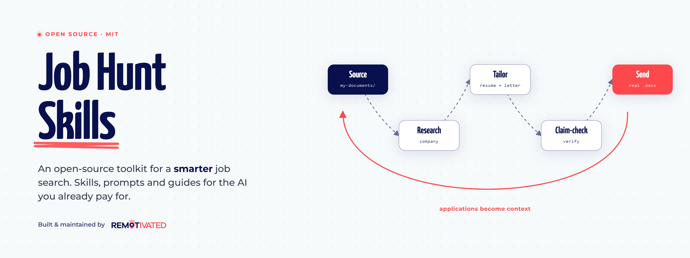
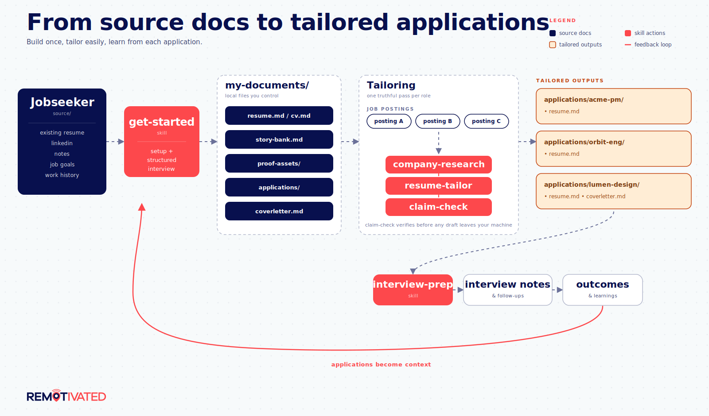
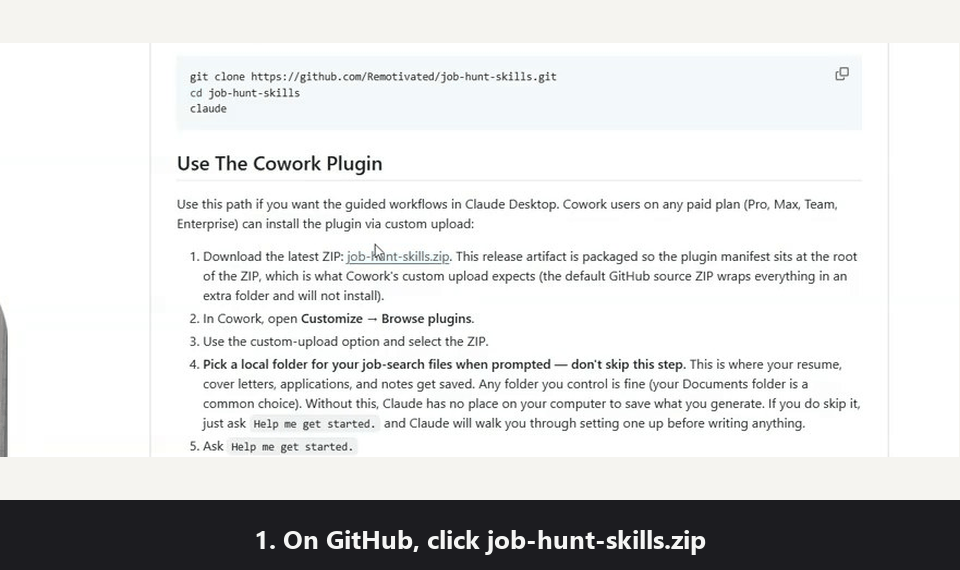
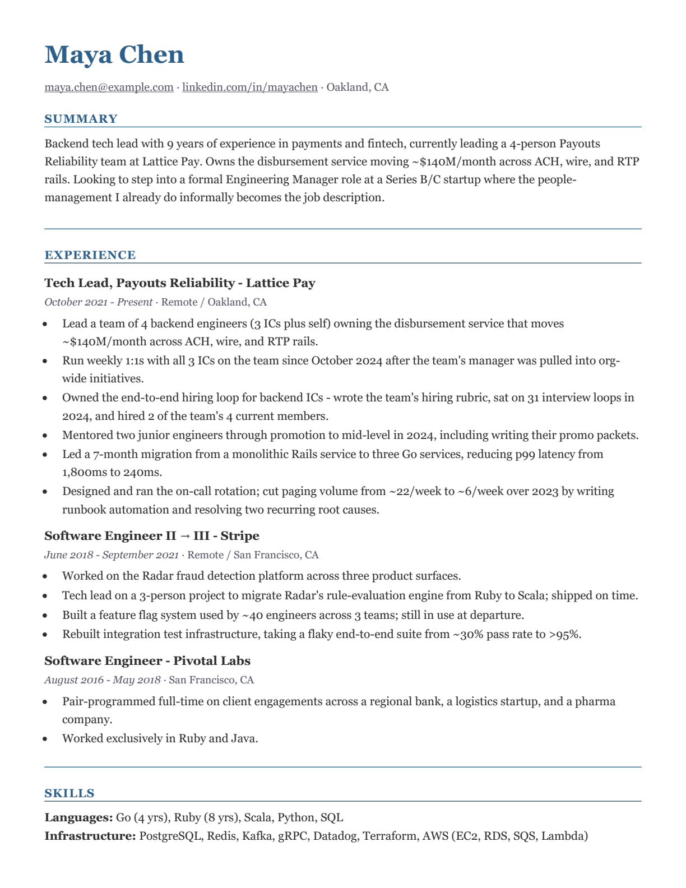
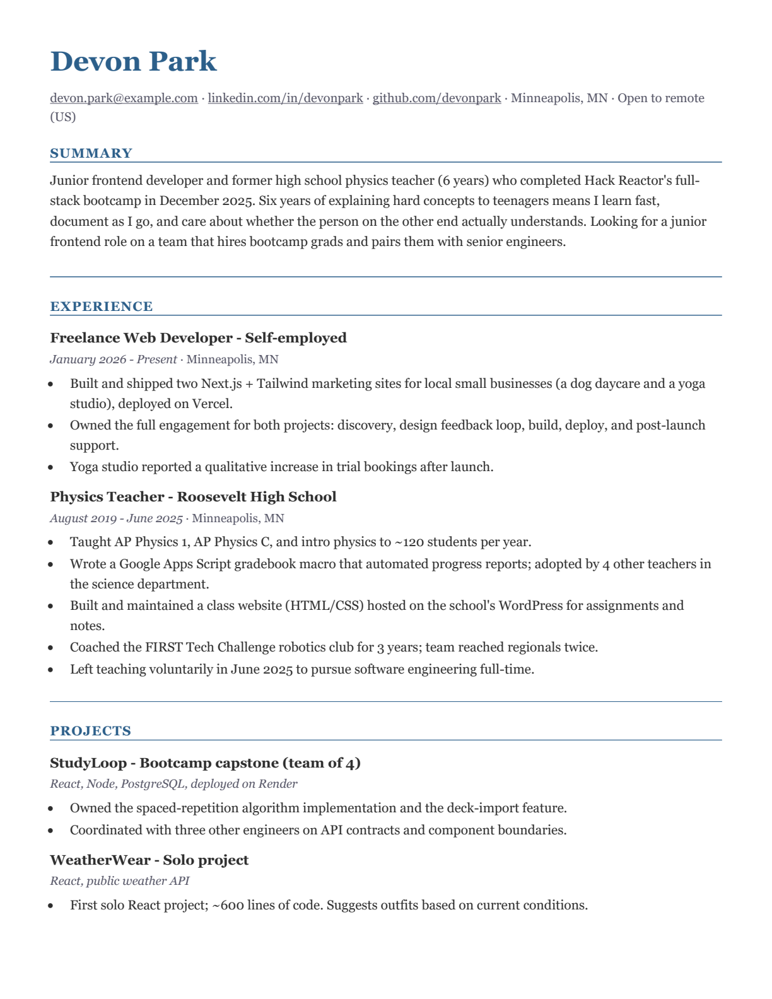
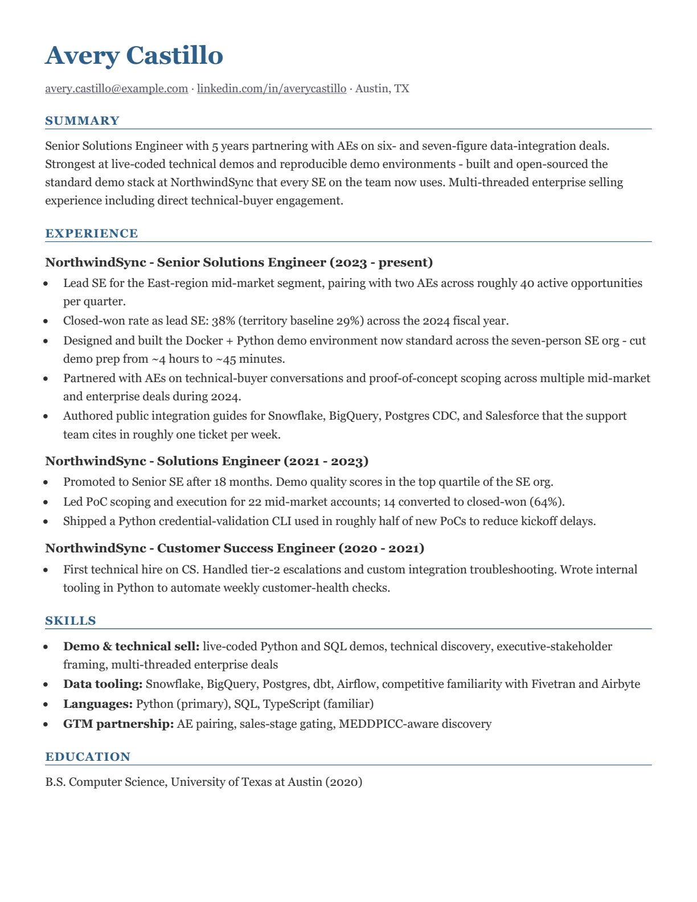

<p align="center">
  
</p>

# Job Hunt Skills

[](LICENSE)
[](https://remotivated.com)
[](https://www.linkedin.com/in/jimatremotivated/)

Practical AI-assisted skills, prompts, guides, and templates to give you an edge in your job search. Open source and free — designed to work with the AI subscription you already pay for.

Most paid "AI for job seekers" tools optimize for volume: auto-applying at scale, filling applications with LLM hallucinations and AI slop. Job Hunt Skills takes the opposite approach. It helps you turn real experience into stronger resumes, cover letters, company research, interview prep, LinkedIn copy, and proof assets — using Claude Code, Claude Cowork, ChatGPT, Gemini, or any LLM you already have access to. Simple enough to use as a prompt library, structured enough to run as your full job search system, and strict about not inventing claims.

It also compounds. Every verified bullet, story, or proof point you confirm during one application is offered for capture into your canonical files, so each tailoring starts from richer source material than the last.

## Contents

- [Start Here](#start-here) — pick your install path
- [What You Can Do](#what-you-can-do)
- [How The Workflow Fits Together](#how-the-workflow-fits-together)
- [New To Claude Code, Cowork, Plugins, Or Skills?](#new-to-claude-code-cowork-plugins-or-skills)
- [Use The Claude Code Plugin](#use-the-claude-code-plugin)
- [Use The Cowork Plugin](#use-the-cowork-plugin)
- [Start With These Skills](#start-with-these-skills)
- [Use The Prompts](#use-the-prompts)
- [Read The Guides](#read-the-guides)
- [Example Outputs](#example-outputs)
- [Your Data Stays On Your Machine](#your-data-stays-on-your-machine)
- [Real Submission-Ready Files](#real-submission-ready-files)
- [Repository Map](#repository-map)
- [Philosophy](#philosophy)
- [Contributing](#contributing)

## Start Here

Choose the path that matches how you want to work.

| Path | Best for | First action |
| --- | --- | --- |
| Claude Code plugin | You are comfortable opening a terminal and want Claude to read and write local job-search files. | [Install the plugin](#use-the-claude-code-plugin), then ask `Help me get started.` |
| Cowork plugin | You want the same guided workflows in Claude Desktop without living in the terminal. | [Install the plugin in Cowork](#use-the-cowork-plugin), choose a local folder, then ask `Help me get started.` |
| Prompt library | You want to use ChatGPT, Gemini, Claude.ai, or another LLM without plugin access. | Jump to [Use The Prompts](#use-the-prompts) or open [prompts/README.md](prompts/README.md). |
| Manual clone | You want to inspect the repo, run scripts, or use Claude Code from a local checkout. | See the [clone fallback](#use-the-claude-code-plugin) and start Claude Code from the repo folder. |

After installation, [Getting Started](GETTING-STARTED.md) walks through the first useful week: build one source work document, research one real company, tailor one application, and prepare for one interview.

## What You Can Do

- **Build** resumes and CVs with an interactive interview or enhance your existing one
- **Tailor** per-role applications without inflating claims.
- **Research** companies and roles before spending serious time applying.
- **Prep** for interviews and track them through to offer.
- **Sharpen** LinkedIn headline, About, and Experience sections.
- **Show** your work with case studies and proof assets.
- **Verify** every claim before you hit send.
- **Grow** your canonical evidence base — verified facts and stories from each application feed back into your source files, so the next one starts ahead.

## How The Workflow Fits Together

<p align="center">
  
</p>

The main workflow is intentionally simple:

1. Build a source resume or CV that captures the real story in depth.
2. Save proof points, constraints, preferences, and applications in local files.
3. Research a company before deciding whether to spend serious time applying.
4. Tailor a resume and (and cover letter if required) for each role.
5. Claim-check the final materials against canonical docs to keep your LLM honest.
6. Prepare for interviews using the same source material, story bank, and company research.
7. Track interviews, follow-ups, offers, and negotiation notes.

Everything else in the repo supports that loop.

After each tailoring run, the skills offer to capture meaningfully new facts you verified during that application into your source resume, story bank, or proof assets. The more you use it, the less work each application takes as your past resumes build the context for your future ones.

## New To Claude Code, Cowork, Plugins, Or Skills?

You do not need to understand the internals to use this repo, but these terms help:

- **Claude Code** is Anthropic's terminal-based agent. You open a folder, start `claude`, and ask it to work with files in that folder.
- **Cowork** is the Claude Desktop agentic workspace. It uses a graphical app instead of a terminal and can work on local files you choose to share.
- **Plugins** are installable bundles of Claude capabilities. This plugin packages the job-search workflows in this repo.
- **Skills** are focused workflows inside the plugin, such as `resume-builder`, `company-research`, `resume-tailor`, and `claim-check`. Claude can load a skill when your request matches it, or you can invoke one by name.

The practical difference from a normal chat is file access. With Claude Code or Cowork, the skills can keep your source documents, story bank, reports, and application folders together in a local workspace. With prompt-only use, you paste the relevant material yourself and manually verify the output.

## Use The Claude Code Plugin

Use this path if you want a terminal workflow and local markdown files.

Prerequisites:

- Claude Code installed.
- A Claude plan that supports plugins and skills.
- A folder where you want your job-search workspace to live.

Start Claude Code in that folder:

```bash
claude
```

Then run these commands inside Claude Code:

```text
/plugin marketplace add Remotivated/job-hunt-skills
/plugin install job-hunt-skills@remotivated
/reload-plugins
```

Start with a plain-language request:

```text
Help me get started.
```

If you prefer explicit commands, use `/job-hunt-skills:get-started`. The plugin also includes quick slash commands such as `/job-hunt-skills:resume-builder` and `/job-hunt-skills:cover-letter`.

Clone fallback:

```bash
git clone https://github.com/Remotivated/job-hunt-skills.git
cd job-hunt-skills
claude
```

## Use The Cowork Plugin

Use this path if you want the guided workflows in Claude Desktop. Cowork users on any paid plan (Pro, Max, Team, Enterprise) can install the plugin via custom upload:



1. Download the latest ZIP: [job-hunt-skills.zip](https://github.com/Remotivated/job-hunt-skills/releases/latest/download/job-hunt-skills.zip). This release artifact is packaged so the plugin manifest sits at the root of the ZIP, which is what Cowork's custom upload expects (the default GitHub source ZIP wraps everything in an extra folder and will not install).
2. In Cowork, open **Customize → Browse plugins**.
3. Use the custom-upload option and select the ZIP.
4. **Pick a local folder for your job-search files when prompted — don't skip this step.** This is where your resume, cover letters, applications, and notes get saved. Any folder you control is fine (your Documents folder is a common choice). Without this, Claude has no place on your computer to save what you generate. If you do skip it, just ask `Help me get started.` and Claude will walk you through setting one up before writing anything.
5. Ask `Help me get started.`

Cowork is best when you want the agent to work through a multi-step task while keeping progress visible. Your Claude plan and Anthropic account govern model usage; this repo itself does not run a hosted service or collect your job-search files.

## Start With These Skills

| Skill | Use it when... |
| --- | --- |
| [get-started](skills/get-started/SKILL.md) | You are new and want the fastest path to a first draft. |
| [resume-builder](skills/resume-builder/SKILL.md) | You want to build or update a resume/CV-format work document. |
| [resume-tailor](skills/resume-tailor/SKILL.md) | You have a specific job posting and want targeted materials. |
| [company-research](skills/company-research/SKILL.md) | You want to decide whether a company or role is worth your time. |
| [cover-letter](skills/cover-letter/SKILL.md) | You only need a specific cover letter. |

Once you have traction, add [interviewing](skills/interviewing/SKILL.md) to manage interview-stage notes, [interview-coach](skills/interview-coach/SKILL.md) for deep prep, and [resume-auditor](skills/resume-auditor/SKILL.md) for a harder critique.

### Optional Skills

| Skill | What it does |
| --- | --- |
| [resume-auditor](skills/resume-auditor/SKILL.md) | Gives direct resume feedback instead of generic praise. |
| [interview-coach](skills/interview-coach/SKILL.md) | Builds an interview prep brief from your actual experience. |
| [interviewing](skills/interviewing/SKILL.md) | Tracks interview stages, notes, and follow-ups. |
| [linkedin-optimizer](skills/linkedin-optimizer/SKILL.md) | Audits and rewrites LinkedIn sections. |
| [proof-asset-creator](skills/proof-asset-creator/SKILL.md) | Helps turn experience into case studies and portfolio proof. |
| [claim-check](skills/claim-check/SKILL.md) | Checks final materials for unsupported or inflated claims. |

## Use The Prompts

If you use ChatGPT, Gemini, Claude.ai, or another LLM without plugins, start with the copy/paste prompts in [prompts/](prompts/). They do not require installation or local files.

| Prompt | Use it when... |
| --- | --- |
| [resume-builder](prompts/resume-builder.md) | You need a source work document in resume or CV format. |
| [resume-audit](prompts/resume-audit.md) | You want blunt feedback on a resume. |
| [resume-tailor](prompts/resume-tailor.md) | You want a tailored resume and cover letter for one role. |
| [company-research](prompts/company-research.md) | You want a structured employer research pass. |
| [interview-prep](prompts/interview-prep.md) | You want likely questions, talking points, and questions to ask. |
| [cover-letter](prompts/cover-letter.md) | You want a specific cover letter for one role. |
| [linkedin-audit](prompts/linkedin-audit.md) | You want LinkedIn positioning help. |
| [proof-asset](prompts/proof-asset.md) | You want a case study, portfolio piece, or proof idea. |
| [claim-check](prompts/claim-check.md) | You want a final unsupported-claims check before sending. |

Prompt-only use has one important rule: verify anything the model adds or reframes before you send it. The skills can check saved evidence; prompts rely on your manual review.

## Read The Guides

The guides explain the methodology behind the skills and prompts.

| Guide | What it covers |
| --- | --- |
| [Resume Philosophy](guides/resume-philosophy.md) | Outcomes, angles, and honest tailoring. |
| [ATS Myths](guides/ats-myths.md) | What ATS systems do and do not do. |
| [Company Research](guides/company-research.md) | A practical employer vetting process. |
| [Remote Job Market](guides/remote-job-market.md) | Why remote roles need sharper targeting. |
| [Interview Framework](guides/interview-framework.md) | How to prepare and what to ask back. |
| [Networking](guides/networking-guide.md) | A low-cringe relationship-building rhythm. |
| [Proof Assets](guides/proof-assets.md) | How to show evidence beyond a resume. |
| [Negotiation](guides/negotiation-guide.md) | How to handle offers and tradeoffs. |
| [Sustainable Search](guides/sustainable-search.md) | Weekly pacing that does not burn you out. |

## Example Outputs

<p align="center">
  
  
  
</p>

<p align="center"><sub>Senior backend tech lead | Bootcamp grad and former teacher | Senior solutions engineer — all US resumes.</sub></p>

Source markdown and rendered PDFs for each example live in [examples/](examples/). All three are synthetic personas, generated end-to-end through the same pipeline real users get.

## Real Submission-Ready Files

Most AI job-search tools stop at copy-paste output. This one produces real files you can attach. The skills save markdown first, then `scripts/generate-docx.py` renders resumes, CVs, and cover letters to `.docx` and writes a `.html` preview next to each input; it also creates PDFs when LibreOffice is installed.

```bash
pip install python-docx markdown-it-py
python scripts/generate-docx.py my-documents/resume.md my-documents/coverletter.md
```

LibreOffice is optional. If it is missing, the script still writes valid `.docx` and `.html` files. The HTML mirrors page geometry, so you can open it in any browser to eyeball formatting without Word or LibreOffice. DOCX and PDF remain canonical for submission.

## Repository Map

| Path | What it contains |
| --- | --- |
| [skills/](skills/) | Claude Code and Cowork skills. |
| [prompts/](prompts/) | Copy/paste prompts for any LLM. |
| [guides/](guides/) | Job-search methodology and decision support. |
| [templates/](templates/) | Resume, CV, and cover letter scaffolds. |
| [examples/](examples/) | Synthetic sample outputs with rendered files. |
| [scripts/](scripts/) | Export and quality-check scripts. |

## Philosophy

- Write for humans first. ATS compatibility is clean formatting, not magic.
- Tailor the argument, not the facts.
- Research companies before spending serious time applying.
- Use the AI you already pay for. No new subscriptions, no auto-apply middleman.
- AI should sharpen your thinking, not replace your judgment.
- Nothing earned is lost. Verified evidence from every application flows back into your canonical files, so the system gets better the more you use it.

## Contributing

Contributions are welcome. See [CONTRIBUTING.md](CONTRIBUTING.md). 

## License

MIT. See [LICENSE](LICENSE) for details.
